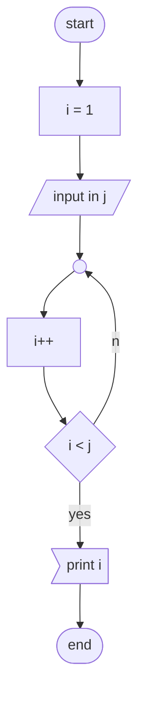
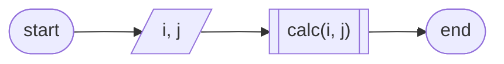
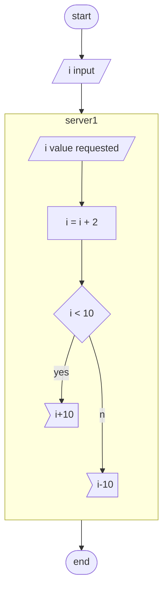

# test folder
This is only a test

```mermaid
flowchart TB
    st(["start"])
    inp[/input in j/]
    finish(["end"])
    condition{"i < j"}
    blank((" "))
    out>"print i"]
    p1["i = 1"]
    st --> p1 --> inp
    p2["i++"]
    inp--> blank
    blank --> p2--> condition --no--> blank 
    condition --yes--> out
    out --> finish
```

```mermaid
flowchart LR
    st(["start"])
    finish(["end"])
    calc[["calc(i, j)"]]
    inp1[/i, j/]
    st --> inp1 --> calc --> finish
```

```mermaid
flowchart TB
    st(["start"])
    inp1[/i input/]
    en(["end"])
    subgraph s1["server1"]
        direction TB
        inp2[/i value requested/]
        p1["i = i + 2"]
        c1{i < 10}
        o1>"i+10"]
        o2>"i-10"]
        inp2 --> p1 --> c1
        c1 --yes--> o1
        c1 --no--> o2
    end
    st --> inp1 --> s1 --> en

```